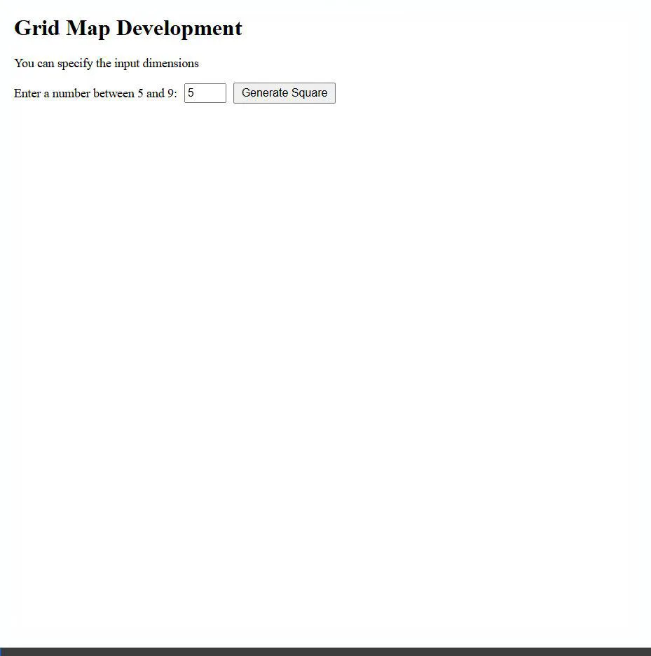

# 0304DRL_HW1 - Grid Map Development & Policy Evaluation

**[Live Demo](https://enwu03.github.io/0304DRL_HW1/)**



This project is an implementation of a Grid Map reinforcement learning environment built entirely with **Pure HTML, CSS, and vanilla JavaScript**. It does not require any backend server to run.

## Features
* **Grid Map Generation**: Allows users to specify dimensions (between 5x5 to 9x9) to generate a dynamic grid map.
* **Environment Setup**: Users can interactively set up the Start state (Green), End state (Red), and Obstacles (Grey) by clicking on the grid cells.
* **Policy Evaluation**: Performs policy evaluation using a uniform random stochastic policy. It visualizes:
  * **Value Matrix**: The state value $V(s)$ distribution for the grid.
  * **Policy Matrix**: A display of the random deterministic directional arrows.

## Setup and Execution

Since this is a fully client-side application without any backend dependencies, running it is incredibly simple:

### Option 1: Live Demo (Recommended)
You can directly interact with the application through GitHub Pages without downloading anything:
👉 **[Click here for the Live Demo](https://enwu03.github.io/0304DRL_HW1/)**

### Option 2: Run Locally
1. Clone this repository to your local machine:
   ```bash
   git clone https://github.com/enwu03/0304DRL_HW1.git
   ```
2. Navigate to the project folder.
3. Simply double-click on `index.html` to open it in any modern web browser (such as Chrome, Edge, or Safari). No installation or local server is required! *(Note: Ensure `style.css` and `script.js` remain in the same folder as `index.html` for the page to display and function correctly.)*
